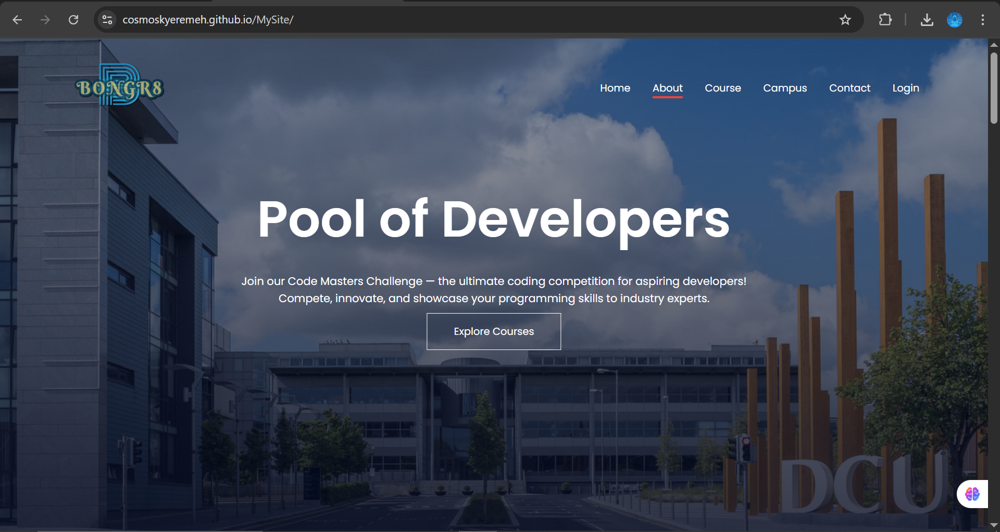
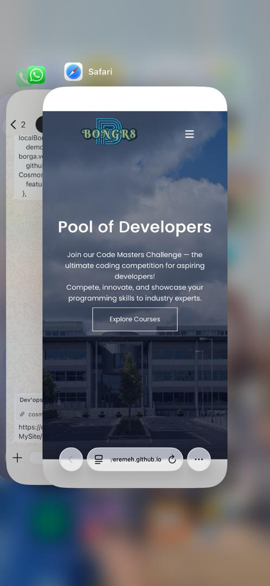
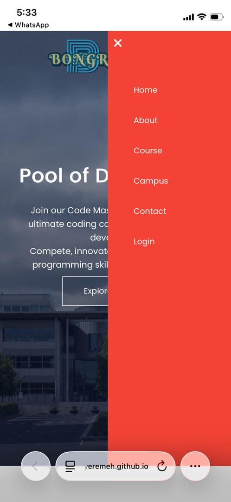

# 🖥️ Dev'ops Pool

A responsive developer education landing page with a login UI — built from scratch using HTML, CSS, and vanilla JavaScript.

> **Live Demo:** [your-username.github.io/devops-pool](https://cosmoskyeremeh.github.io/MySite/) 

---

## 📸 Preview

### Desktop


### Mobile


---

## 🚀 Features

- **Responsive navigation** with a smooth mobile slide-out menu
- **Scroll-triggered fade-in animations** — sections animate in as you scroll
- **Smooth scrolling** for all anchor links
- **Login page** with:
  - Real-time email and password validation
  - Toggle password visibility (show/hide)
  - Loading spinner on form submission
  - Toast notification feedback
  - Enter key support
- Semantic, well-commented HTML throughout
- Clean, organised CSS with clear section comments

---

## 🛠️ Tech Stack

| Technology | Purpose |
|---|---|
| HTML5 | Page structure & semantics |
| CSS3 | Styling, layout, transitions |
| Vanilla JavaScript | Menu toggle, scroll animations, form validation |
| Google Fonts | Poppins typeface |
| Font Awesome 6 | Icons throughout the UI |

---

## 📁 Project Structure

```
devops-pool/
│
├── index.html        # Main landing page
├── signIn.html       # Login page
├── style.css         # All styles for index.html
│
└── images/
    └── eduford_img/
        ├── banner.png
        ├── banner2.jpg
        ├── myLogo.png
        ├── london.png
        ├── newyork.png
        ├── washington.png
        ├── library.png
        ├── basketball.png
        ├── cafeteria.png
        ├── user1.jpg
        └── user2.jpg
```

---

## 🏃 Running Locally

No build tools or installs needed — it's pure HTML/CSS/JS.

```bash
# 1. Clone the repo
git clone https://github.com/your-username/devops-pool.git

# 2. Open the folder
cd devops-pool

# 3. Open index.html in your browser
#    (or use the Live Server extension in VS Code for auto-reload)
```

---

## 🌐 Deploying to GitHub Pages

1. Push your code to GitHub
2. Go to your repo → **Settings** → **Pages**
3. Under **Source**, select `main` branch and `/ (root)` folder
4. Click **Save** — your site will be live in ~1 minute at:
   `https://your-username.github.io/devops-pool`

---

## 🔮 What's Next (Planned Improvements)

- [ ] Connect login form to a real backend (Node.js / Firebase)
- [ ] Add a Sign Up page with matching validation
- [ ] Dark mode toggle
- [ ] Animate the hero heading on page load
- [ ] Add a courses detail page

---

## 🧠 What I Learned

- Resolving Git merge conflicts
- Using the Intersection Observer API for scroll animations
- Building accessible, validated forms without any libraries
- Structuring a multi-page static site cleanly

---

## 👤 Author

**BonGr8**
- GitHub: [@cosmoskyeremeh](https://github.com/cosmoskyeremeh)

---

### Mobile


---

## 📄 License

This project is open source and available under the [MIT License](LICENSE).
